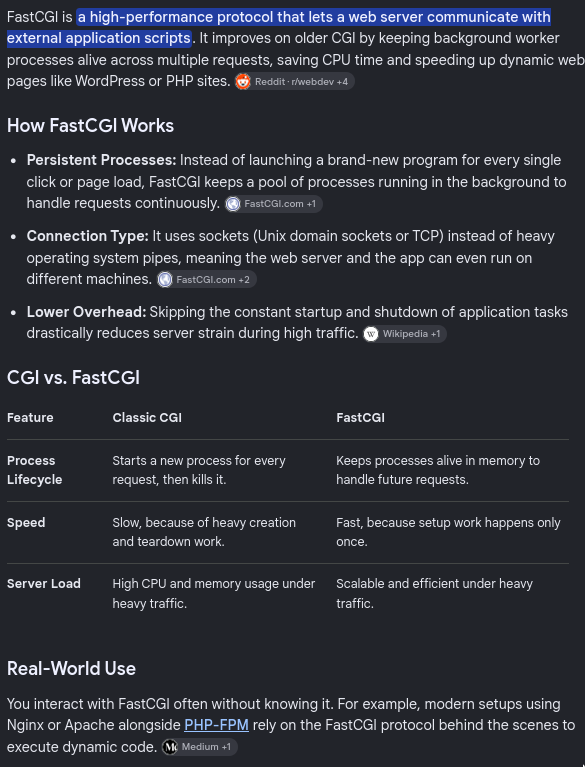

# Q&A — WordPress container

---

## 1. Packages

Why these three, and not more: `php8.2-fpm`, `php8.2-mysql`, `ca-certificates`? What breaks if you drop each one?

<details>
<summary>Answer</summary>

- **php8.2-fpm**: PHP is interpreted, not compiled. Fix the term: php-fpm is a process manager that runs PHP worker processes, and those workers execute PHP code.
- **php8.2-mysql**: right idea, more precise, it's a PHP extension (mysqli/pdo_mysql) that gives PHP the functions to speak the MySQL wire protocol to MariaDB. Without it, WordPress's DB calls are undefined functions.
- **ca-certificates**: wrong. This container does no TLS handshake with anything, nginx handles that separately. ca-certificates is here because `ADD` and `wp core download` fetch over HTTPS, it supplies the trusted CA bundle so this container's HTTPS client can verify the remote server's certificate (GitHub, wordpress.org). Drop it and `wp core download` fails cert verification, confirmed by testing.

</details>

---

## 2. php-fpm

What is php-fpm, in your own words? Is it a web server? What protocol does it speak?

<details>
<summary>Answer</summary>

Correct, keep the nuance: the master process doesn't execute PHP itself, it manages a pool of worker processes, and the workers do the executing. "FastCGI Process Manager" is literally the name.

- **What it is**: a daemon that spawns and manages a pool of PHP worker processes, then hands each incoming request to one of them to execute the PHP code.
- **Is it a web server**: no. It has no HTTP parsing, no static file serving, no listening for browser requests directly. It only understands FastCGI, so it needs a real web server (nginx) in front of it.
- **Protocol**: FastCGI, not HTTP.

<p align="center"></p>
<p align="center"><i>FastCGI vs classic CGI: persistent worker processes instead of a fork per request.</i></p>

</details>

---

## 3. wp-cli

Why is `ADD .../wp-cli.phar` there instead of `apt-get install wordpress`? What does wp-cli actually let you do that plain files on disk don't?

<details>
<summary>Answer</summary>

wp-cli is a `.phar` that loads WordPress's own PHP source directly (it bootstraps `wp-load.php`) and calls WordPress's internal functions from the shell. No HTTP request, no browser. That's what lets `entrypoint.sh` run `wp config create`, `wp core install`, `wp user create`, etc. as plain shell commands instead of clicking through the browser install wizard, which is required since nothing in this project has a human sitting at a keyboard on first boot.

</details>

---

## 4. Build time vs run time

`RUN wp core download` runs at build time. What WordPress setup step can't run at build time, and why not?

<details>
<summary>Answer</summary>

The step is `wp core install` (creating `wp-config.php` + running the actual install). It can't run at build time for two separate reasons:

- it needs DB credentials, which are secrets and don't exist during `docker build`
- it needs a live, reachable mariadb container, which doesn't exist yet either, `docker build` only ever builds one image in isolation, no other containers are running

Both are runtime facts, so this has to live in `entrypoint.sh`.

</details>

---

## 5. The COPY line

Look at line 9 of the Dockerfile: `COPY conf/www.conf /etc/php/8.2/fpm/pool.d/www-listen.conf`. Is this correct right now? Why or why not?

<details>
<summary>Answer</summary>

Wrong, and this is the live bug. Load order is backwards.

Alphabetical load order compares characters: `-` is `0x2D`, `.` is `0x2E`. So `www-listen.conf` sorts before `www.conf`, meaning `www-listen.conf` loads first, and the shipped default `www.conf` loads last. Per the merge rule (last-loaded directive wins), `www.conf`'s original `listen = /run/php/php8.2-fpm.sock` is what actually takes effect, `0.0.0.0:9000` gets silently discarded. Confirmed with `php-fpm8.2 -tt` and a failed cross-container connect on port 9000.

Still broken in the current Dockerfile. Fix: rename the `COPY` destination to something that sorts after `www.conf`, e.g. `www2.conf` (`2` is `0x32`, sorts after `.`).

</details>

---

## 6. chown

Line 15 ends with `chown -R www-data:www-data /var/www/html`. Who is `www-data`, and what fails if that chown is missing?

<details>
<summary>Answer</summary>

`www-data` is the low-privilege system user the `php8.2-fpm` package creates on install (UID 33). Inside `www.conf` the pool has `user = www-data` / `group = www-data`, meaning php-fpm's worker processes run as www-data, not root.

But `RUN wp core download` runs during `docker build`, as root. So every downloaded WordPress file lands owned by root:root. Without the `chown -R www-data:www-data`, php-fpm workers can still read those files fine (world-readable), but can't write to them, no plugin installs, no core self-update, no file uploads to `wp-content/uploads`. It fails silently on writes only, which makes it an easy bug to miss until uploading media is attempted.

</details>

---

# Networking

---

## 1. Port

What is a port, and why does it exist at all if an IP address already identifies the machine?

<details>
<summary>Answer</summary>

**A port is a 16-bit number identifying one endpoint of a connection inside a single machine.**

The IP address gets a packet to the right machine. But a machine runs many programs that all want network traffic, so the port tells the kernel which one a packet belongs to.

```text
packet arrives at 172.18.0.6
        │
        ▼
kernel reads the destination port
        │
        ├── 443   -> nginx
        ├── 3306  -> mariadbd
        └── 6379  -> redis-server
```

A port is not an object that exists on its own. It is a two-byte field in the TCP header, so the range is 0 to 65535. A process asks the kernel to reserve one with `bind()`, and the kernel then delivers packets carrying that number to that process.

**IP address = the machine. Port = the program on it.**

</details>

---

## 2. Connection

What is a TCP connection?

Answer given: *"a connection is when the browser talks to nginx, and nginx listens to the same port the browser talks to."*

<details>
<summary>Answer</summary>

Half right, and the wrong half is the important one: **the two sides do not use the same port.**

**A TCP connection is a two-way byte stream between two endpoints, identified by four values: source IP, source port, destination IP, destination port.**

The server's port is fixed and known in advance. The client's port is a random high number the kernel picks at connect time, called an ephemeral port.

```text
browser  192.168.1.20:54321  ─────>  nginx  172.18.0.6:443
         └── random, chosen at connect time    └── fixed, chosen by the server
```

The four values are what make a connection unique, which is why ten browser tabs can open ten connections to the same `:443`: they share three values and differ only in the client port.

A connection is **state held in the kernel on both machines**, not an object travelling on the wire. It is created by a three-message handshake, after which each side tracks what it sent, what it received, and what the peer acknowledged.

```text
client                                server
  │  SYN            ──────────────>     │   "I want to open a connection"
  │  <──────────── SYN-ACK              │   "accepted"
  │  ACK            ──────────────>     │   established, bytes can flow
```

</details>

---

## 3. Listening socket vs connection

`ss -ltn` shows `0.0.0.0:443 LISTEN`. How is that different from the connection created when a request arrives?

<details>
<summary>Answer</summary>

**A listening socket is not a connection.** It is a standing offer to accept them.

Each accepted client produces a separate connection with its own four-tuple, while the listening socket stays open for the next one. One listening socket, many connections.

This is also why `bind to = 0.0.0.0` mattered for netdata in § 13 e: binding decides which interfaces the listening socket will accept arrivals on, before any connection exists.

</details>

---

## 4. Why the asymmetry

Why must the browser know nginx's port in advance, while nginx does not need to know the browser's?

Answer given: *"because the browser is the client, it sends the request and nginx responds to that port."*

<details>
<summary>Answer</summary>

Correct. Sharpened: nginx is not *told* the client's port, it **reads it from the header of the SYN packet that arrived**, and replies to that.

The general rule:

```text
the side that connects   needs the peer's address and port in advance
the side that listens    learns the peer's address and port on arrival
```

</details>

---

## 5. Why FTP breaks that rule

FTP uses two TCP connections, not one. What are they, and why does that asymmetry become a problem?

<details>
<summary>Answer</summary>

```text
control connection   stays open for the whole session, carries only text commands
data connection      opened fresh for each transfer, carries the file bytes, then closes
```

The problem is who opens the second one.

```text
active mode    server ──connects to──> client    client says "call me back on port N"
passive mode   client ──connects to──> server    server says "call me on port N"
```

**Active mode inverts the roles**: the client must become the listener, and the server must be told which port to reach it on. Behind NAT or a firewall, nothing outside can reach that port, so the transfer fails while the control connection still looks healthy.

That is why passive mode is the default in practice, and it is the reason a containerised FTP server needs both `pasv_address` and a fixed, published passive port range.

</details>
